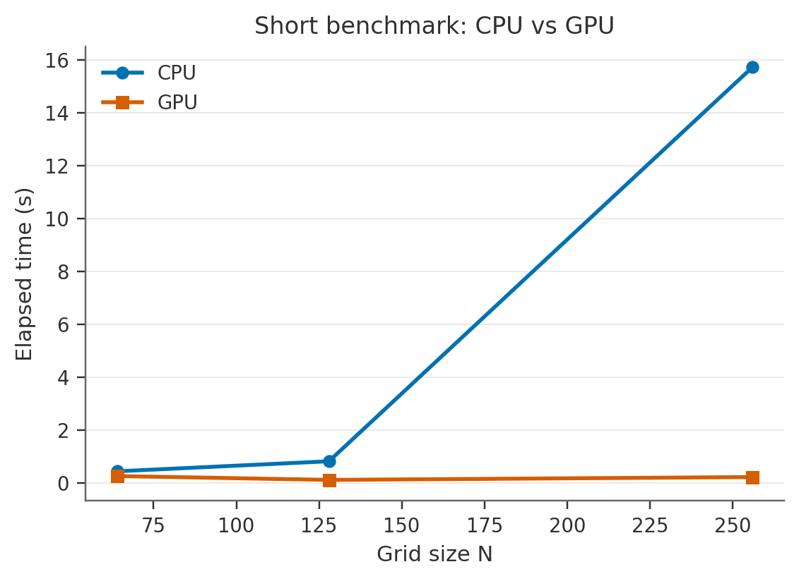
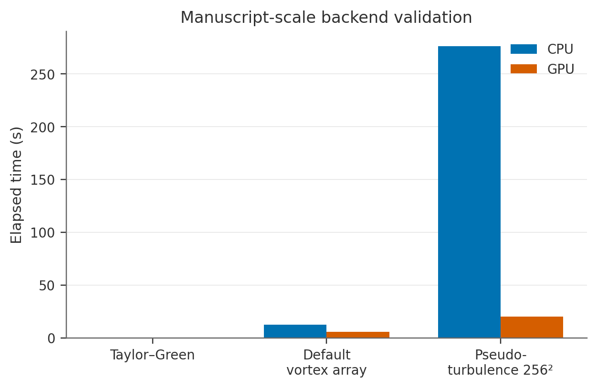

# Backend and performance results

This page summarizes the current CPU↔GPU comparison results that are generated from the repository.

## Short benchmark

The short benchmark uses `simutime_seconds = 1.0` and compares elapsed runtime for CPU and GPU backends.



Measured runtimes:

| Grid | CPU (s) | GPU (s) |
|---|---:|---:|
| 64² | 0.445 | 0.265 |
| 128² | 0.824 | 0.120 |
| 256² | 15.716 | 0.227 |

Interpretation:

- for this environment, the GPU is already competitive at `64²`
- by `128²`, the GPU is clearly faster
- at `256²`, FFT-dominated work strongly favors the GPU backend

## Manuscript-scale backend validation

These comparisons use the same solver algorithm and double precision on both backends.
The CPU backend is treated as the reference implementation.



### Runtime summary

| Case | CPU (s) | GPU (s) |
|---|---:|---:|
| Taylor–Green | 0.194 | 0.122 |
| Default vortex array | 12.706 | 5.584 |
| Pseudo-turbulence 256² | 276.447 | 20.130 |

### Numerical agreement summary

Representative maximum relative errors from `manuscript_gpu_validation.json`:

| Case | `Ekin_max_rel` | `Diss_max_rel` |
|---|---:|---:|
| Taylor–Green | 2.55e-15 | 2.85e-15 |
| Default vortex array | 6.16e-15 | 6.74e-16 |
| Pseudo-turbulence 256² | 2.37e-14 | 3.47e-15 |

These are all extremely small and consistent with close CPU↔GPU agreement in double precision.

## Files generated for this page

- `assets/generated/backend/benchmark.json`
- `assets/generated/backend/benchmark_runtime.png`
- `assets/generated/backend/manuscript_gpu_validation.json`
- `assets/generated/backend/manuscript_runtime.png`

## Regenerating the results

```bash
python scripts/generate_docs_artifacts.py
```

That script reruns the benchmark and manuscript-scale backend validation and updates the tracked documentation assets.
