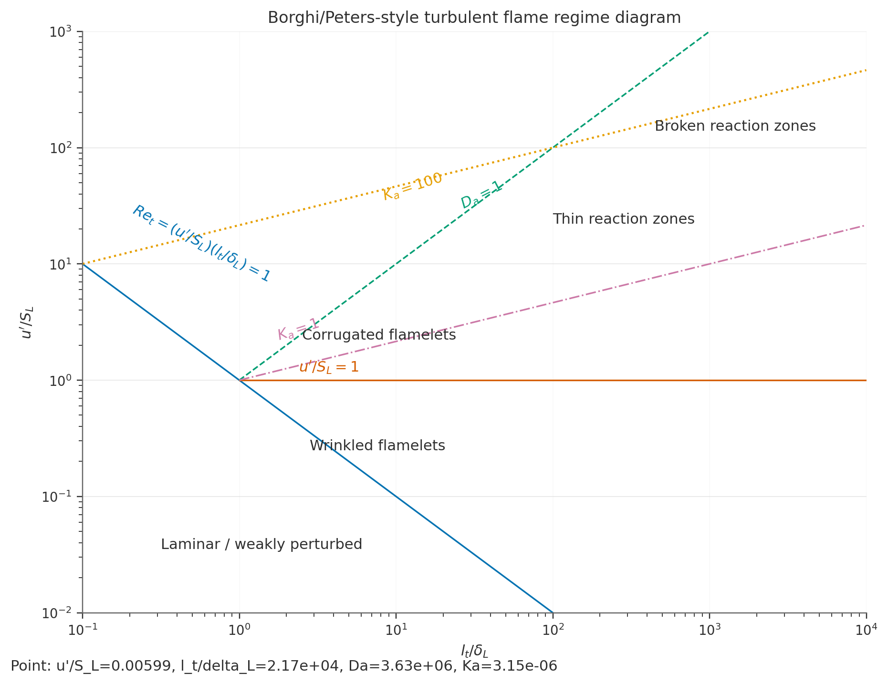

# Flame/HIT workflow results

This page demonstrates the current downstream combustion workflow using a generated NS2dLab velocity field.

## Example turbulence field

The example field was generated with:

- backend: CPU
- grid: `256 × 256`
- time step: `0.05 s`
- total simulation time: `50 s`

The final field snapshot is saved as `artifacts/docs_case_256_field.npz` during the generation workflow.

## HIT statistics

Computed from `hit-stats`:

| Quantity | Value |
|---|---:|
| `u'_component` | 0.01387 |
| `u'_planar` | 0.01961 |
| `l_t,x` | 0.36383 |
| `l_t,y` | 0.46844 |
| `l_t,mean` | 0.41614 |
| `k_2D` | 1.9228e-4 |

These values come from `assets/generated/flame/hit_stats.json`.

## Laminar flame properties

The current example uses a lightweight Cantera case for documentation generation:

- mechanism: `h2o2.yaml`
- fuel: `H2`
- oxidizer: `O2:1.0, AR:5.0`
- `phi = 1.0`
- `T_u = 300 K`
- `P_u = 101325 Pa`

Computed values:

| Quantity | Value |
|---|---:|
| `S_L` | 2.31445 m/s |
| `alpha_u` | 4.4301e-5 m²/s |
| `delta_alpha` | 1.9141e-5 m |
| `delta_T` | 4.0310e-4 m |
| `T_b` | 2496.11 K |

These values come from `assets/generated/flame/flame_properties.json`.

## Regime diagram placement

The case is then placed on a Borghi/Peters-style diagram using:

- `u' = component RMS`
- `delta_L = delta_alpha`



Derived point:

| Quantity | Value |
|---|---:|
| `u'/S_L` | 5.991e-3 |
| `l_t/delta_L` | 2.174e4 |
| `Da` | 3.629e6 |
| `Ka` | 3.145e-6 |

Important note: this remains an **approximate classification** because the classical regime diagram is rooted in 3D turbulent premixed flames, whereas the present turbulence field is 2D HIT.

## OpenFOAM export example

The documentation workflow also exports the final field to an OpenFOAM 7 `U` file.

Example snippet:

```text
--8<-- "assets/generated/openfoam/U_snippet.txt"
```

The exported file is a `volVectorField` with vectors of the form `(Ux Uy 0)`.
The caller must ensure the flattening order matches the target OpenFOAM mesh ordering.

## Files generated for this page

- `assets/generated/flame/hit_stats.json`
- `assets/generated/flame/flame_properties.json`
- `assets/generated/flame/regime_diagram.json`
- `assets/generated/flame/regime_diagram.png`
- `assets/generated/openfoam/U_snippet.txt`
