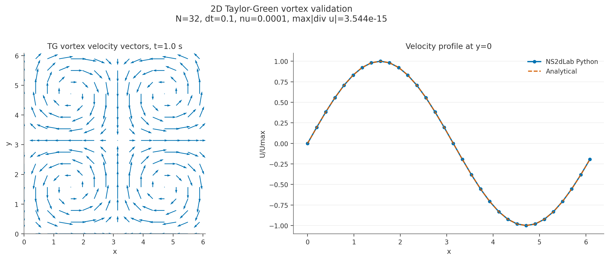
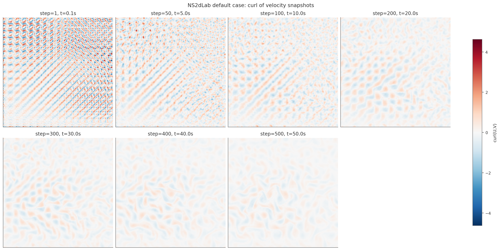
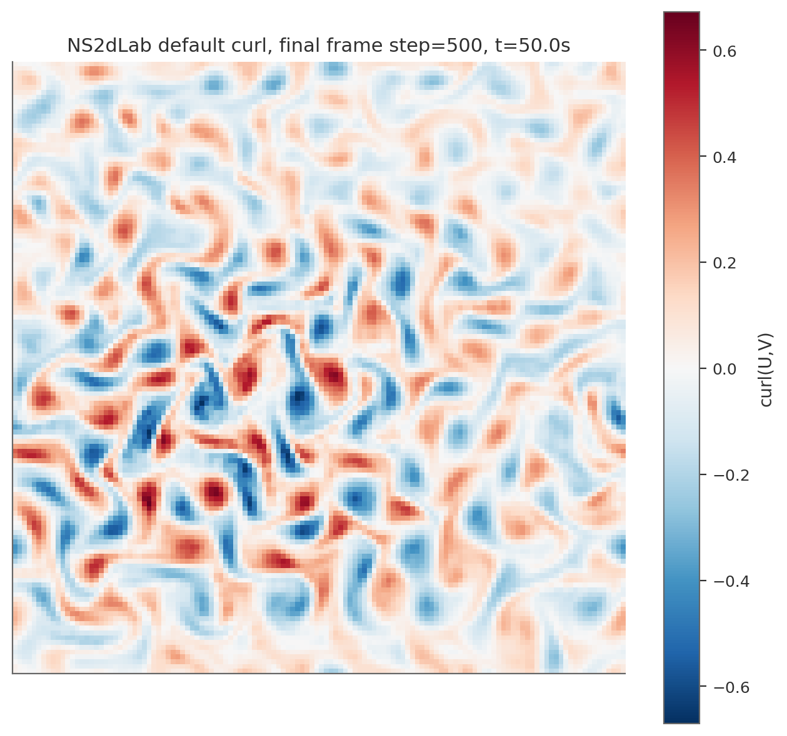
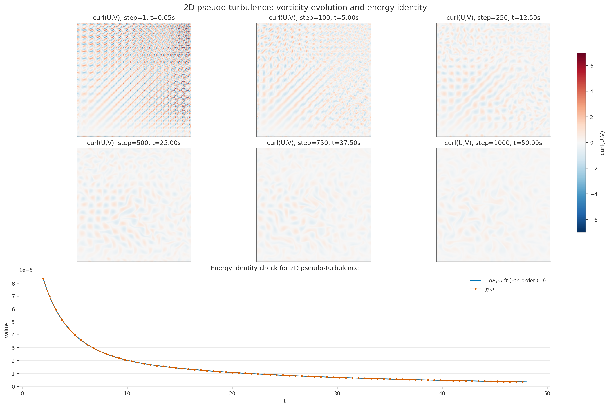
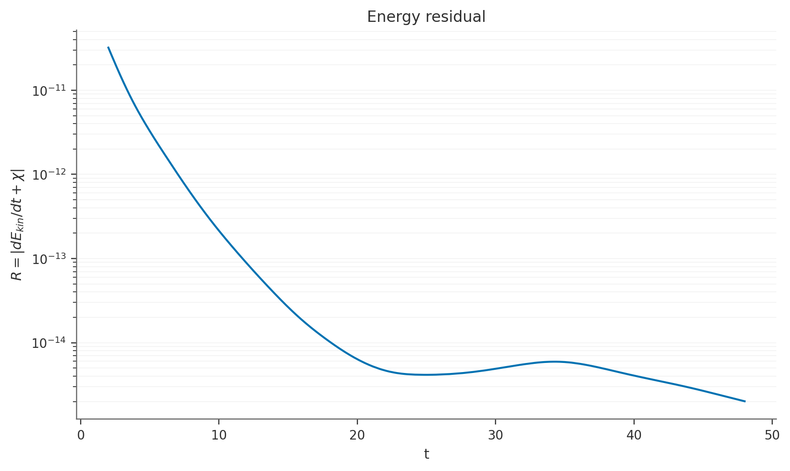

# Validation results

This page collects the main validation figures generated from the current codebase.
All images were regenerated directly from the repository using the shared documentation-artifact workflow.

## Taylor–Green vortex analytical validation

This case checks whether the solver reproduces a known analytical solution while maintaining very small divergence.

Summary highlights from `taylor_green_summary.txt`:

- final time: `1.0 s`
- grid: `32 × 32`
- time step: `0.1 s`
- viscosity: `1e-4`
- max absolute divergence: approximately `1e-15`
- velocity errors: small and consistent with a source-faithful pseudo-spectral implementation

## Default vortex-array case: curl evolution

This plot is a qualitative manuscript-style check. It shows the development of the default NS2dLab flow field through vorticity/curl snapshots.

Final frame:

## 2D pseudo-turbulence: energy identity

This case checks the periodic-domain energy balance by comparing

\[
-\frac{dE_{kin}}{dt}
\quad \text{and} \quad
\chi(t)
\]

for a decaying 2D turbulence-like run.

Residual plot:

Summary from `turbulence_summary.txt`:

- grid: `256 × 256`
- time step: `0.05 s`
- total physical time: `50 s`
- the interior energy-identity residual remains small relative to the signal, supporting physical consistency of the implementation

## What these checks establish

Taken together, these validation results support three complementary claims:

1. **analytical correctness** on Taylor–Green vortex
2. **qualitative flow evolution fidelity** on the default NS2dLab case
3. **physical consistency** through the turbulence energy identity

These are intentionally combined with automated tests and CPU↔GPU agreement checks rather than relying on bundled MATLAB reference files.
